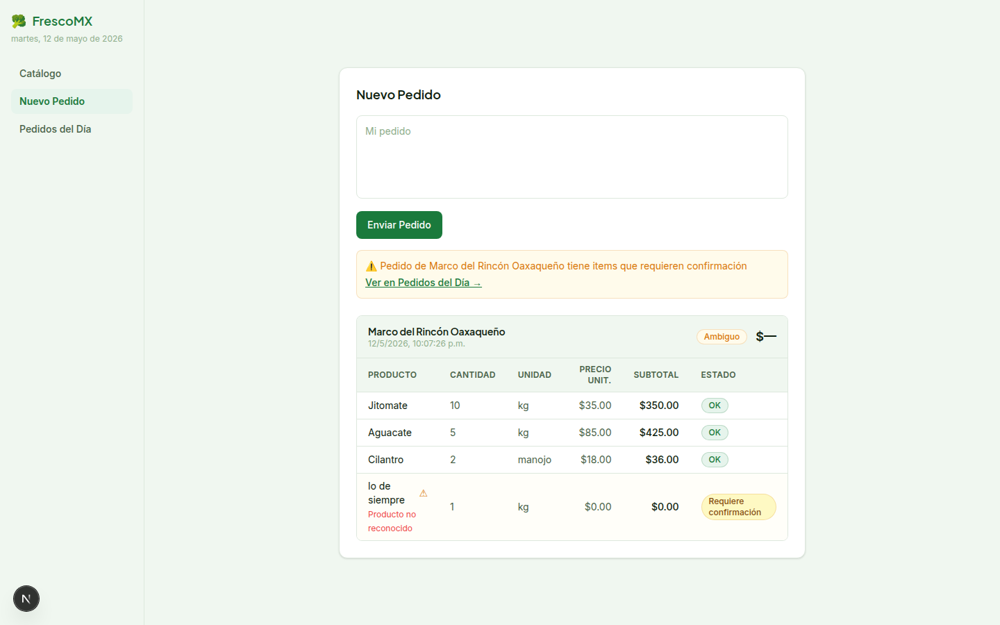

# FrescoMX — Order Panel

A functional web panel for FrescoMX operators (B2B fruit & vegetable distributor) to process orders arriving via WhatsApp as natural language messages. Full flow: paste raw message → AI parsing → structured, editable order ready to fulfill.



**Demo:** _pending deploy_

---

## How it works

1. Operator pastes a WhatsApp message in **"Nuevo Pedido"**
2. `POST /api/parse` sends the raw text + catalog to OpenAI
3. `gpt-4o-mini` extracts client name, products, quantities and units
4. **Matching fuzzy** against the local catalog (by product name or synonyms, accent-normalized)
5. Unrecognized products or ambiguous quantities are flagged with `ambiguo: true`
6. The order appears in an editable table with calculated total
7. **"Pedidos del Día"** shows all orders of the day with KPIs (total confirmed, count by status)
8. **"Catálogo"** is a reference view with search for operators to verify products and prices

---

## Stack

| Layer | Technology | Reason |
|-------|-----------|--------|
| Framework | Next.js 16 (App Router) | SSR + API Routes in one repo; auto-detected by Vercel. Note: v16 has breaking changes vs v14/v15 |
| Language | TypeScript | Shared types between API and UI with no overhead |
| Styles | Tailwind CSS v4 | Fast prototyping; color tokens defined in `globals.css` |
| AI | OpenAI `gpt-4o-mini` | Best cost/quality ratio for structured extraction; `response_format: json_object` guarantees valid JSON |
| State | React `useState` in-memory | Brief explicitly rules out a real DB and localStorage; in-memory is sufficient |
| Fonts | Plus Jakarta Sans (display) + Inter (body) | Via `next/font`, zero layout shift |

---

## Project structure

```
frescomx-order-panel/
├── app/
│   ├── api/parse/route.ts      # POST endpoint that calls OpenAI
│   ├── layout.tsx              # Fonts + metadata (browser tab title)
│   ├── page.tsx                # Shell: sidebar + 3 tabs
│   └── globals.css             # Tailwind + color tokens
├── components/
│   ├── CatalogTable.tsx        # Reference catalog with search
│   ├── DailyOrdersTable.tsx    # Accumulated daily view with KPIs
│   ├── OrderTable.tsx          # Single order table (inline editable)
│   └── ParseInput.tsx          # Textarea + parse button
├── data/
│   └── catalog.json            # 16 products with prices and synonyms
├── lib/
│   ├── types.ts                # Shared types (Product, DailyOrder, ParsedOrder...)
│   └── parser.ts               # buildOrderItems(): fuzzy matching + subtotal calculation
├── docs/
│   ├── ui-design.md            # Design system: color tokens, components, rules
│   ├── screenshots/            # Project screenshots
│   │   └── nuevo-pedido.png
│   └── tasks.md                # Checklist de avance
└── README.md                   # This file
```

---

## Environment variables

Create a `.env.local` file at the root:

```bash
OPENAI_API_KEY=sk-...
```

For Vercel: add `OPENAI_API_KEY` under **Settings → Environment Variables** before deploying.

---

## Run locally

```bash
npm install
npm run dev
```

Open http://localhost:3000

---

## Deploy on Vercel

1. Push to repo (already done)
2. Go to [vercel.com/new](https://vercel.com/new) → import this repo
3. Add `OPENAI_API_KEY` environment variable
4. Deploy — Next.js 16 is auto-detected, zero extra config

---

## Test messages

### Example 1 — clean order
```
Buenas, para mañana mándame 10 kg jitomate, 5 kg aguacate hass maduros, 2 manojos cilantro y 3 kg limón. Soy Marco del Rincón Oaxaqueño.
```

### Example 2 — urgent order
```
hola lalo, urgente: 3kg cebolla morada, 1 kg chile poblano, 8 piezas piña. Hotel Mítico
```

### Example 3 — edge case: fully ambiguous
```
manden lo de siempre porfa, gracias. Cocina Norte
```

---

## Decisions made and discarded

**Made:**
- `gpt-4o-mini` with `response_format: json_object` → parseable JSON without fragile regex
- Fuzzy catalog matching with accent normalization (`lib/parser.ts`) → handles "jitomate", "tomate", "jitomatito"
- In-memory state with `useState` → no DB latency; brief didn't require persistence
- Sidebar with 3 tabs (Catálogo / Nuevo Pedido / Pedidos del Día) → operator can reference catalog while parsing
- Inline feedback banner after parsing instead of a modal → operator doesn't need to confirm anything, just gets notified
- Order status derived from items: `confirmed` only when ALL items have `ambiguous: false`

**Discarded:**
- Database (Supabase, SQLite) → over-engineering for a validation prototype
- Authentication → out of scope per brief
- AI response streaming → unnecessary for short WhatsApp messages
- WebSockets for real-time updates → no multiple operators in this prototype
- localStorage / sessionStorage → explicitly ruled out by brief

**With more time:**
- Real persistence (orders survive page reload)
- CSV/Excel export for daily route
- Per-client view with order history
- Real WhatsApp Business API integration
- Product images in catalog table
